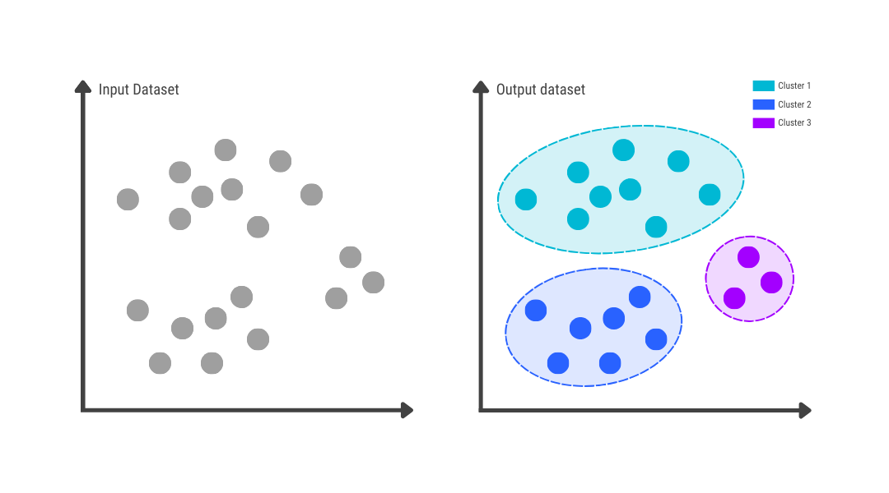
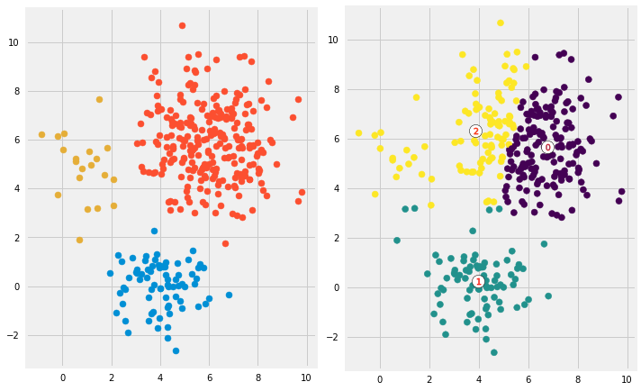

# Ml Clustering

In machine learning, we usually deal with two main types of problems — supervised and unsupervised learning.

In supervised learning, we work with labeled data, which means we already know the correct outputs. This makes it easier to train and fine-tune models since we can directly measure how well they perform. Examples include predicting house prices or classifying whether an email is spam or not.

On the other hand, unsupervised learning is used when there are no labels or known outputs. Here, the goal is to explore the data and find hidden patterns or relationships within it.

A common example of unsupervised learning is clustering, where we group similar data points together based on their characteristics. For instance, recommendation systems like YouTube ads or music suggestions on Spotify use clustering to group users with similar interests or behavior.

In short, clustering helps us make sense of unlabeled data by organizing it into meaningful groups — which can then be used for insights, recommendations, or decision-making.

 

There are numerous algorithms available to solve clustering problems, and each uses a different approach to group data points. Below are some of the most commonly used clustering algorithms categorized by their underlying method.

## Clustering Algorithms

- Centroid-Based Methods

  These algorithms group data points based on their distance from central points (called centroids).
    - K-Means
    - Mini-Batch K-Means
    - K-Medoids
 
- Density-Based Methods

  These identify clusters as regions of high data density separated by regions of low density.
    - DBSCAN (Density-Based Spatial Clustering of Applications with Noise)
    - OPTICS (Ordering Points To Identify the Clustering Structure)
    - HDBSCAN (Hierarchical DBSCAN)

- Hierarchical Methods

  These algorithms build a tree-like structure of clusters, showing how clusters are formed or merged at different levels.
    - Agglomerative Clustering (bottom-up approach)
    - Divisive Clustering (top-down approach)
    
- Distribution-Based Methods

  These assume that data points are generated from specific probability distributions, such as Gaussian distributions.
    - Gaussian Mixture Models (GMMs)

- Other Popular Methods
    - Mean Shift – shifts data points toward the nearest cluster center.
    - Affinity Propagation – identifies exemplars among data points and forms clusters around them.
    - BIRCH (Balanced Iterative Reducing and Clustering using Hierarchies) – efficient for large datasets.
    - Spectral Clustering – uses graph theory and eigenvalues to cluster data in complex structures.
    
## Centroid-Based Methods

### K-Means 

K-Means is straightforward once you understand some basic math. The algorithm partitions data into K clusters by iteratively updating cluster centroids.

Steps : 
- Randomly select K samples as initial centroids.
   - 
- Compute the distance of each data point to all K centroids.
- Assign each point to the nearest centroid.
- Update each centroid based on the mean of points assigned to it.
- Repeat steps 2–4 until the cluster assignments no longer change or converge.

Lets see mathematical view

Step1 :

We have a dataset with n samples, each with j features

$$
X  = \\{ x_1,x_2,..,x_j \\} \quad x_j \in \mathbb{R}^j
$$

We want to partition these n samples into K clusters:

$$
 C_1,C_2,..,C_k 
$$

Let the initial centroids be:

$$
 c_1,c_2,..,c_k \quad c_k \in \mathbb{R}^j
$$

Step2 : 

For each sample $$x_i$$, assign it to the nearest centroid

$$
 \text{Assign } x_i \text{ to cluster } C_k \text{ such that : }  k = \arg\min_k || x_i - c_k ||^2
$$

Step 3 :

After assigning points, update each centroid to be the mean of points in its cluster:

$$
 \ c_k = \frac{1}{|C_k|} \sum_{x_i \in \mathbb{C_k} }x_i
$$

Where ${|C_k|}$ is the number of points in cluster ${C_k}$

Step 4 : 

Though out the process our aim is to reduce total within-cluster variance

$$
 J = \sum_{k=0}^{K}\sum_{x_i \in \mathbb{C_k} }|| x_i - c_k ||^2
$$

- J is called the distortion function or inertia.

- The algorithm iterates assignment → update until J converges (changes very little) or cluster assignments stop changing

Disadvantages
- Requires specifying K: You must decide the number of clusters beforehand, which may not be obvious for real-world data.
- Sensitive to initial centroids: Poor initialization can lead to suboptimal clustering or different results on multiple runs.

- Sensitive to outliers: Outliers can skew centroids, causing clusters to shift away from the true center of the data.
- Assumes spherical clusters: K-Means works best when clusters are roughly circular/spherical and of similar size. It struggles with non-linear or irregularly shaped clusters (e.g., elongated, cylindrical, or crescent-shaped).

- May converge to local minima: The algorithm optimizes the objective function locally, not globally, so it might not find the best overall clustering.
- Feature scaling matters: K-Means relies on distance measures, so features with larger scales can dominate the clustering unless data is standardized.
- Sensitive to noise: High levels of noise in data can reduce clustering quality.

