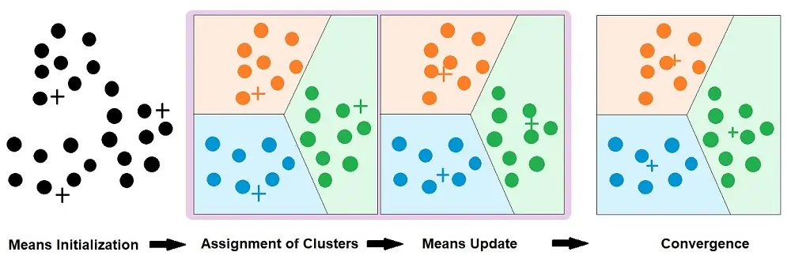
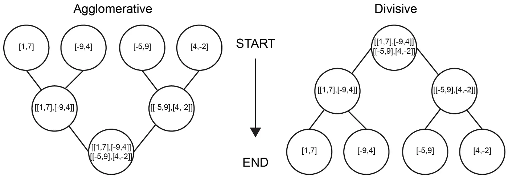
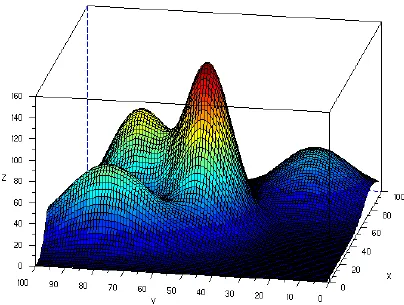
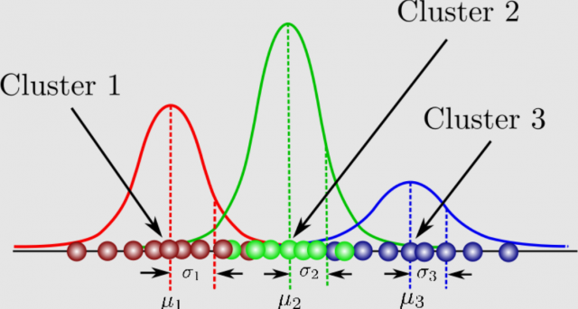
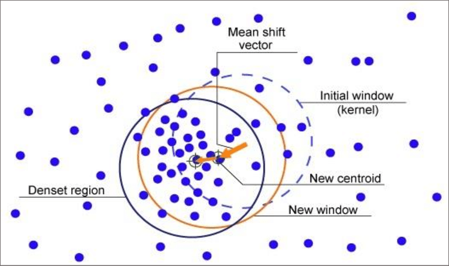
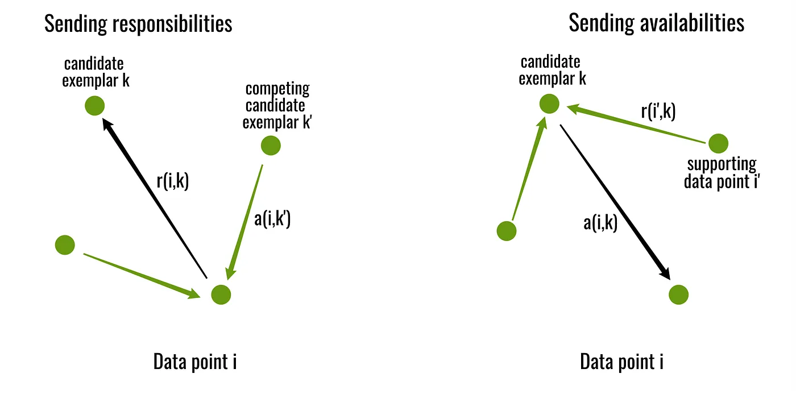
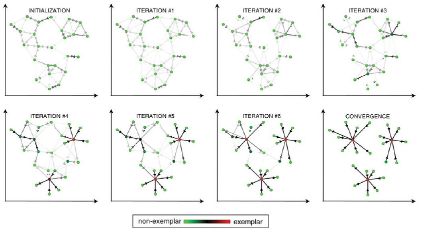

# Ml Clustering

In machine learning, we usually deal with two main types of problems — supervised and unsupervised learning.

In supervised learning, we work with labeled data, which means we already know the correct outputs. This makes it easier to train and fine-tune models since we can directly measure how well they perform. Examples include predicting house prices or classifying whether an email is spam or not.

On the other hand, unsupervised learning is used when there are no labels or known outputs. Here, the goal is to explore the data and find hidden patterns or relationships within it.

A common example of unsupervised learning is clustering, where we group similar data points together based on their characteristics. For instance, recommendation systems like YouTube ads or music suggestions on Spotify use clustering to group users with similar interests or behavior.

In short, clustering helps us make sense of unlabeled data by organizing it into meaningful groups — which can then be used for insights, recommendations, or decision-making.

 

There are numerous algorithms available to solve clustering problems, and each uses a different approach to group data points. Below are some of the most commonly used clustering algorithms categorized by their underlying method.

  
## Clustering Algorithms

- Centroid-Based Methods

  These algorithms group data points based on their distance from central points (called centroids).
    - K-Means
    - Mini-Batch K-Means
    - K++ Means
    - K-Medoids
 
- Density-Based Methods

  These identify clusters as regions of high data density separated by regions of low density.
    - DBSCAN (Density-Based Spatial Clustering of Applications with Noise)
    - OPTICS (Ordering Points To Identify the Clustering Structure)
    - HDBSCAN (Hierarchical DBSCAN)

- Hierarchical Methods

  These algorithms build a tree-like structure of clusters, showing how clusters are formed or merged at different levels.
    - Agglomerative Clustering (bottom-up approach)
    - Divisive Clustering (top-down approach)
    
- Distribution-Based Methods

  These assume that data points are generated from specific probability distributions, such as Gaussian distributions.
    - Gaussian Mixture Models (GMMs)

- Other Popular Methods
    - Mean Shift – shifts data points toward the nearest cluster center.
    - Affinity Propagation – identifies exemplars among data points and forms clusters around them.
    - BIRCH (Balanced Iterative Reducing and Clustering using Hierarchies) – efficient for large datasets.
    - Spectral Clustering – uses graph theory and eigenvalues to cluster data in complex structures.
      
  
## Centroid-Based Methods

### K-Means 
---
K-Means is straightforward once you understand some basic math. The algorithm partitions data into K clusters by iteratively updating cluster centroids.

 

**Steps** : 
- Randomly select K samples as initial centroids. 
- Compute the distance of each data point to all K centroids.
- Assign each point to the nearest centroid.
- Update each centroid based on the mean of points assigned to it.
- Repeat steps 2–4 until the cluster assignments no longer change or converge.
- [View K-Means manual code implementation](kmeans.py)

 

Lets see mathematical view

Step1 :

We have a dataset with n samples, each with j features

$$
X  = \\{ x_1,x_2,..,x_j \\} \quad x_j \in \mathbb{R}^j
$$

We want to partition these n samples into K clusters:

$$
 C_1,C_2,..,C_k 
$$

Let the initial centroids be:

$$
 c_1,c_2,..,c_k \quad c_k \in \mathbb{R}^j
$$

Step2 : 

For each sample $$x_i$$, assign it to the nearest centroid

$$
 \text{Assign } x_i \text{ to cluster } C_k \text{ such that : }  k = \arg\min_k || x_i - c_k ||^2
$$

Step 3 :

After assigning points, update each centroid to be the mean of points in its cluster:

$$
 \ c_k = \frac{1}{|C_k|} \sum_{x_i \in \mathbb{C_k} }x_i
$$

Where ${|C_k|}$ is the number of points in cluster ${C_k}$

Step 4 : 

Though out the process our aim is to reduce total within-cluster variance

$$
 J = \sum_{k=0}^{K}\sum_{x_i \in \mathbb{C_k} }|| x_i - c_k ||^2
$$

- J is called the distortion function or inertia.

- The algorithm iterates assignment → update until J converges (changes very little) or cluster assignments stop changing

 

**Disadvantages**
- Requires specifying K: You must decide the number of clusters beforehand, which may not be obvious for real-world data.
- Sensitive to initial centroids: Poor initialization can lead to suboptimal clustering or different results on multiple runs.

- Sensitive to outliers: Outliers can skew centroids, causing clusters to shift away from the true center of the data.
- Assumes spherical clusters: K-Means works best when clusters are roughly circular/spherical and of similar size. It struggles with non-linear or irregularly shaped clusters (e.g., elongated, cylindrical, or crescent-shaped).

- May converge to local minima: The algorithm optimizes the objective function locally, not globally, so it might not find the best overall clustering.
- Feature scaling matters: K-Means relies on distance measures, so features with larger scales can dominate the clustering unless data is standardized.
- Sensitive to noise: High levels of noise in data can reduce clustering quality.

  

### Mini Batch K-Means 
---
Mini-Batch K-Means is a variant of the traditional K-Means algorithm designed to handle large-scale datasets efficiently.

When we have more than a million records, the standard K-Means algorithm becomes computationally expensive because it needs to calculate the distance between every data point and each centroid during every iteration. This leads to excessive computation time and memory usage, making K-Means less feasible for big data applications.

To overcome this, Mini-Batch K-Means introduces the concept of mini-batches. Instead of using the entire dataset to update centroids in each iteration, it randomly selects a small batch of samples. The centroids are then updated based on these batches, and the process continues iteratively with new random batches. This approach significantly reduces computation time while still producing results similar to the standard K-Means algorithm.

 

**Key points** : 
- Computationally efficient compared to standard K-Means.
- Uses random mini-batches to update centroids, improving scalability.
- Inherits the same disadvantages as K-Means (e.g., need to predefine k, sensitivity to initialization, and potential convergence to local minima).
- [View Mini-Batch K-Means manual code implementation](kmeans.py)

  

### K-Means++
---
K-Means++ is an improved version of the standard K-Means algorithm that focuses on selecting better initial centroids to achieve more stable and accurate clustering results.

In the traditional K-Means algorithm, the initial centroids are chosen randomly from the dataset. This randomness can lead to poor clustering results — for example, if the selected centroids are very close to each other, the resulting clusters may not represent the data distribution effectively.

K-Means++ solves this problem by choosing the initial centroids in a more intelligent and distance-aware way. It ensures that centroids are as far apart as possible, which leads to faster convergence and better cluster separation.

 

**Steps to Select Initial Centroids**:
- Select one random sample from the dataset as the first centroid.
- For each data point ${x_i}$, compute the distance ${D(x_i)}$ to the nearest already chosen centroid

$$
  D(x_i) = \min_{c_j \in C} ||x_i - c_j||^2
  $$
- Choose the next centroid probabilistically, where the probability of selecting a point is proportional to the square of its distance

$$
P(x_i) = \frac{D(x_i)^2}{\sum_{x_j \in X} D(x_j)^2}
$$
- Repeat steps 2–3 until all k centroids are initialized.
- Proceed with the standard K-Means algorithm (assignment and update steps).
- [View K++Means manual code implementation](kppmeans.py)

K-Means++ only improves the initialization step of K-Means.

It still inherits all the disadvantages of the standard K-Means algorithm

  

### K-Medoids
---
K-Medoids is a clustering algorithm similar to K-Means, but instead of using the mean of cluster points as the center, it uses an actual data point (called a medoid) as the cluster representative.
This makes K-Medoids more robust to noise and outliers.

 

**Steps**:

- Select k random medoids from the dataset as initial centers.
- Assign each data point to the nearest medoid based on a distance metric (e.g., Euclidean or Manhattan distance).
- For each cluster, attempt to swap the medoid with a non-medoid data point and calculate the total cost (sum of distances of all points to their nearest medoid):

$$
\text{Cost} = \sum_{i = 1}^n \text{distance}{(x_i,m(x_i))}
$$

$$
\text{where } m(x_i) \text { is the medoid closest to point } x_i
$$

- If the swap reduces the total cost, update the medoid; otherwise, keep the current one.
- Repeat steps 2–4 until no change in medoids occurs or the cost function converges.
- [View K-Medoids manual code implementation](kmedoids.py)

 

**Advantages** : 
- Works well with non-Euclidean and categorical data.
- Less sensitive to outliers compared to K-Means.
- Produces more stable clusters because medoids are actual points.

 

**Disadvantages**:
- Computationally expensive for large datasets (especially the PAM algorithm).
- Requires specifying the number of clusters (k) in advance.
- May still converge to local minima, depending on initial medoid selection.

  

| Feature                          | K-Means                         | K-Means++                        | Mini-Batch K-Means              | K-Medoids                        |
|---------------------------------|---------------------------------|---------------------------------|---------------------------------|----------------------------------|
| Cluster Shape                    | Spherical / convex             | Spherical / convex               | Spherical / convex               | Spherical / convex                  |
| Handles Noise                    | No                              | No                               | No                               | Yes                              |
| Initialization                   | Random                         | Smart (max distance based)       | Random / K-Means++               | Random / heuristic               |
| Speed / Scalability              | Medium                          | Slightly slower than K-Means     | Fast / scalable for large data   | Slower than K-Means              |
| Sensitivity to Initialization    | High                            | Low                              | Medium                            | Low                              |
| Memory Usage                      | Moderate                        | Moderate                         | Low                               | High                             |
| Robustness to Outliers           | Low                             | Low                              | Low                               | High                             |
| Number of Clusters (K) Required | Yes                             | Yes                              | Yes                               | Yes                              |
| Suitable for Large Datasets      | Moderate                        | Moderate                         | Yes                               | No                               |
| Algorithm Type                   | Partitioning                   | Partitioning                     | Partitioning                     | Partitioning (Medoid-based)      |

    

## Density-Based Methods

Centroid-based clustering methods, like K-Means, are limited because they can only detect spherical or circular clusters. They often fail when clusters have arbitrary or irregular shapes. To address this limitation, density-based clustering methods were introduced.

In density-based approaches, instead of just looking at distance, we consider the density of points around a particular location. Clusters are formed in regions where points are densely packed, while sparse regions are treated as noise or outliers.

  

### DBSCAN (Density-Based Spatial Clustering of Applications with Noise)
---
DBSCAN is a popular density-based clustering algorithm. The key idea is simple: group points that are close together and have enough neighbors.

 

**Main concepts**:
- ε (epsilon): How close points need to be to be considered neighbors
- MinPts: Minimum number of points required to form a dense area
- Core point: A point with at least MinPts neighbors → forms the center of a cluster
- Border point: A point near a core point but not dense enough to be a core itself
- Noise: A point that doesn’t belong to any cluster

 

**Steps** :
- Start with a point: Pick any unvisited point from the dataset and find its neighbors.
   - A neighbor is any point whose distance from the current point is less than or equal to ε (epsilon).
     
$$
{N_ε}\(x\) = \\{ y \in D | \text{dist}\(x,y\) \le  ε \\}
$$

$$
\text{dist}\(x,y\) = \sqrt{\sum_{i=1}^n \( x_i - y_i\)^2}
$$

- Determine the point type:
   - If the number of neighbors (including the current point) is greater than or equal to MinPts, mark the point as a core point.
   - Otherwise, treat it as noise temporarily (it may later become a border point).
 
$$
|N_x\(x\)| \ge \text{MinPts} \quad \Rightarrow \text{ x is core}
$$

$$
\text {x → q if x is core and } q \in {N_ε}\(x\)
$$

- Expand the cluster:
   - For the core point and its neighbors, loop through each neighbor and add them to the current cluster if they are density-reachable.
  

  
- Mark points as visited:
   - Each point is marked as visited when processed to prevent infinite or repeated loops during cluster expansion.
- Repeat the process:
   - Continue this process until all points in the dataset have been visited and assigned to a cluster or marked as noise.

  

 

**Advantages**
- **No need to specify number of clusters (k)** : Unlike K-Means, DBSCAN automatically detects clusters of varying shapes.
- **Can find arbitrarily shaped clusters** : Works well with non-linear or irregular cluster shapes, e.g., crescent or circular clusters.
- **Handles noise/outliers** : Points that do not belong to any cluster are labeled as noise, making the clustering robust.  
- **Clusters based on density, not distance alone** : Works well when clusters have **dense regions separated by sparse regions**.
- **No requirement for initial centroids** : Unlike K-Means or K-Medoids, DBSCAN does not require selecting initial points.

 

**Disadvantages**
- **Difficulty with varying densities** : DBSCAN struggles if clusters have very different densities, as a single ε may not fit all clusters.
- **Parameter sensitivity** : Results heavily depend on **ε (epsilon)** and **MinPts**. Choosing wrong values may produce poor clusters.
- **Not suitable for high-dimensional data** : Distance metrics like Euclidean become less meaningful in high-dimensional spaces (**curse of dimensionality**).
- **Computational complexity** : For large datasets, DBSCAN can be slower compared to simpler algorithms like K-Means, especially if not optimized with spatial indexing.
- **Cannot cluster well-separated uniform-density clusters** : If clusters are widely separated but of similar density, DBSCAN may merge them incorrectly or leave some points as noise.

  

### OPTICS - Ordering Points to Identify the Clustering Structure
---
OPTICS is an advanced density-based clustering algorithm that improves upon DBSCAN. While DBSCAN works well, it has some limitations
- It is highly sensitive to parameter choices like ε (epsilon) and MinPts.
- A slight change in these parameters can produce completely different clusters.
- DBSCAN uses a single ε value for the entire dataset, which makes it unable to detect clusters with varying densities.

OPTICS overcomes these limitations by ordering data points to represent the clustering structure based on density, without requiring a fixed ε value.

 

**OPTICS uses two important distance measures**:

1. Core Distance:
   - For a point p, the core distance is defined as:
   
$$
\text{core-dist}(p) =
\begin{cases} 
\text{distance to MinPts-th nearest neighbor}, & \text{if } |N_\varepsilon(p)| \ge \text{MinPts} \\
\text{undefined}, & \text{otherwise}
\end{cases}
$$
   - If point p has enough neighbors (at least MinPts within ε), it is a core point.
   - Otherwise, its core distance is undefined.

2. Reachability Distance :
    - The reachability distance of point q from point p is:

$$
\text{reach-dist(p,q) = max(core-dist(p),dist(p,q))}
$$

 
 

 

**OPTICS Algorithm Steps** : 

1. Initialization
   - Mark all points as unprocessed.
   - For each point, initialize:
     - Core distance → unknown initially
     - Reachability distance → ∞ (infinity)
2. Pick a starting point
   - Choose any unprocessed point p.
   - Find its ε-neighborhood (neighbors within ε).
     - Note: ε here is not a fixed clustering threshold like in DBSCAN. It is only used to define the search boundary for neighbors.

3. Compute Core Distance
   - If |Nε(p)| ≥ MinPts, p is a core point.
   - Compute its core distance as the distance to its MinPts-th nearest neighbor.

4. Update Reachability Distances
   - For every unprocessed neighbor q of p:
    - Compute reach-dist(p, q)
    - Update q's reachability distance if the new one is smaller

5. Priority Ordering
   - Sort the neighbors by increasing reachability distance
   - Store them in an order list

6. Expand Clusters
   - Continue processing the next point with the smallest reachability distance
   - This expands all density-reachable regions
7. Extract Clusters
   - After ordering all points, define clusters by selecting a reachability distance threshold
   - Points separated by large reachability distances form different clusters

 

**Advantages**
- **Handles Varying Density Clusters** : Unlike DBSCAN, OPTICS can identify clusters with different densities because it does not use a fixed ε value.
- **Less Sensitive to Parameter Settings** : OPTICS reduces the dependency on selecting a perfect ε value, making it more stable than DBSCAN.
- **Produces an Ordered Reachability Plot** : Instead of forcing clusters, OPTICS generates a reachability plot that visually shows the clustering structure.
- **Automatically Detects Noise** : Similar to DBSCAN, OPTICS identifies outliers and separates them from meaningful clusters.
- **Flexible Cluster Extraction** : Clusters can be formed later using **different reachability thresholds**, giving flexibility to the user.

 

**Disadvantages**
- **More Computationally Expensive** : Slower than DBSCAN due to additional ordering operations, especially on large datasets.
- **More Complex to Understand and Implement** : Requires understanding of reachability distance, core distance, and reachability plots.
- **No Direct Cluster Output** : Unlike DBSCAN, OPTICS does not directly produce clusters. Clusters need to be extracted **afterward** using a reachability threshold.
- **Performance Depends on Distance Metric** : Like DBSCAN, OPTICS struggles in **high-dimensional data** due to the curse of dimensionality.
- **Memory Usage** : Stores ordering and reachability distances for all points, which can consume more memory than DBSCAN.

  

### HDBSCAN – Hierarchical Density-Based Spatial Clustering of Applications with Noise
---
HDBSCAN is an improved version of DBSCAN that can find clusters of **varying densities** and **does not require epsilon (ε)**. It builds a **hierarchy of clusters** and selects the most stable ones based on density. Unlike DBSCAN, which struggles with different density clusters and parameter sensitivity, HDBSCAN is more robust and gives better clustering results.

 

**Why HDBSCAN?**
- DBSCAN fails with clusters of **varying densities**.
- It is **sensitive to ε (epsilon)**.
- **Too many noise points** in DBSCAN.
- Cannot discover **hierarchical structure**.
- HDBSCAN **removes ε entirely** and uses **density hierarchy**.

 

**Important Concepts Used in HDBSCAN**
1. Core Distance
   - For a point **p**, the core distance is defined as:
 
 $$
 \text{core-dist}(p)=\text{distance to min\\_samples-th nearest neighbor of } p
 $$

- Measures how dense the region around p is.
- Small core-dist → dense area
- Large core-dist → sparse area

2. Mutual Reachability Distance
    - To avoid incorrectly linking sparse areas, HDBSCAN uses:

$$
\text{mreach-dist}(p, q) = \max(\text{core-dist}(p),\ \text{core-dist}(q),\ d(p,q))
$$

- Makes clustering based on **relative density**.
- Prevents the "single-link effect" from DBSCAN.

3. Cluster Stability (Mathematical Measure)
    - Clusters are chosen based on **stability**, defined as:

$$
\text{Stability}(C) = \sum_{p \in C} \big( \lambda_{\text{birth}}(p) - \lambda_{\text{death}}(p) \big)
$$

Where:

$$
\lambda = \frac{1}{\text{mreach-dist}}
$$

- Clusters that **survive longer** across densities are more **stable**.
- Less stable clusters are treated as **noise**.

 

**HDBSCAN Algorithm Steps**

1. **Initialization**
   - Choose:
     - `min_samples` → Minimum number of neighbors to form a dense region.
     - `min_cluster_size` → Minimum number of points to form a cluster.

2. **Compute Core Distance**
   - For each point p, compute its core-distance:
     - Distance to its min_samples-th nearest neighbor.

3. **Compute Mutual Reachability Distance**
   - Modify all pairwise distances using:
     - `mreach-dist(p, q) = max(core-dist(p), core-dist(q), dist(p,q))`

4. **Build Minimum Spanning Tree (MST)**
   - Construct a Minimum Spanning Tree using mutual reachability distances as edge weights.

5. **Construct Cluster Hierarchy**
   - Sort MST edges from **smallest to largest**.
   - Gradually remove the **largest edges** to form **clusters at multiple density levels**.

6. **Condense the Tree**
   - Remove clusters smaller than `min_cluster_size`.
   - Track how long each cluster persists (birth → death density level).

7. **Extract Final Clusters**
   - Select **most stable clusters**.
   - Points not belonging to any stable cluster are **noise (-1)**.
   

 

**Advantages**
- **No epsilon (ε) required**.
- Detects clusters with **varying densities**.
- **Better noise handling** than DBSCAN.
- Builds a **hierarchical clustering structure**.
- Produces **stable and meaningful clusters**.
- Works well with **real-world noisy data**.

 

**Disadvantages**
- More **computationally expensive** than DBSCAN.
- **Complex to understand** mathematically.
- Struggles with **high-dimensional data**.
- Needs **parameter tuning** (`min_samples`, `min_cluster_size`).
- No **reachability plot visualization** like OPTICS.

 

| Feature                       | DBSCAN                     | OPTICS                              | HDBSCAN                       |
|-------------------------------|----------------------------|------------------------------------|-------------------------------|
| Cluster Shape                 | Arbitrary                  | Arbitrary                           | Arbitrary                     |
| Handles Noise                 | Yes                        | Yes                                  | Yes                           |
| Variable Density Clusters     | No                         | Yes                                  | Yes                           |
| Parameters                    | eps, MinPts               | MinPts, optional eps                 | MinPts / min_cluster_size     |
| Hierarchical Output           | No                         | Yes (reachability plot)             | Yes (condensed hierarchy)     |
| Sensitivity to Parameters     | High                       | Medium                               | Low                           |
| Automatically Determines Clusters | No                     | No                                   | Yes                           |
| Computational Complexity      | O(n log n) – O(n²)         | O(n log n) – O(n²)                   | O(n log n) – O(n²)            |

    
## Hierarchical Methods

Hierarchical clustering is one of the simplest and most intuitive clustering algorithms.  

In this approach, clusters are built using either a **top-down** (divisive) or **bottom-up** (agglomerative) method.  
Clusters are visualized using a tree diagram called a **dendrogram**.  

- By cutting the dendrogram at a certain level, the clusters present at that cut become the **final clusters**.  

  
### Agglomerative Approach (Bottom-up)
---
**Agglomerative clustering is a bottom-up method**:

- Each data point starts as its **own cluster**.  
- At each step, the **two closest clusters** are merged based on a distance metric.  
- This process continues until all points are merged into a single cluster, or a stopping criterion (e.g., desired number of clusters) is reached.  

To measure the **similarity between clusters**, different **linkage methods** are used:

1. Single Linkage (Nearest Neighbor):
   - Distance between the two clusters is the distance between their closest points

$$
D_{single}\(A,B\) = \min_{a \in B, b \in B} d(a,b)
$$

2. Complete Linkage(Farthest Neighbor):
    - Distance between the two clusters is the distance between their fathest points

$$
D_{complete}\(A,B\) = \max_{a \in B, b \in B} d(a,b)
$$

3. Average Linkage:
    - Distance between two clusters is the average of all pairwise distances.

$$
D_{average}\(A,B\) = \frac{1}{|A||B|}\sum_{a \in A}\sum_{b \in B} d(a,b)
$$

4. Centroid Linkage
   - Distance between two clusters is the distance between their centroids

   
$$
D_{centroid}\(A,B\) = d(\bar{a},\bar{b}), \quad \bar{a} = \frac{1}{|A|}\sum_{a \in A}a, \quad \bar{b} = \frac{1}{|B|}\sum_{b \in B}b
$$

5. Ward’s Linkage (Minimum Variance Method)
    - Merges clusters to minimize the increase in total within-cluster variance after merging.

$$
D_{ward}\(A,B\) = \frac{|A||B|}{|A|+|B|} || \bar{a} - \bar{b}||^2
$$

 

**Algorithm Steps**:
- Initialization: Treat each point as its own cluster.
- Compute Distance Matrix: Calculate distances between all clusters using the chosen linkage criterion.
- Find Closest Clusters: Identify clusters with the smallest distance.
- Merge Clusters: Combine the two closest clusters into a single cluster.
- Update Distance Matrix: Recalculate distances between the new cluster and existing clusters.
- Repeat: Continue merging until all points form a single cluster or stopping criterion is met.
- Build Dendrogram: Visualize merges to see cluster hierarchy

 

**Advantages**:
- Produces a dendrogram, showing hierarchical relationships.
- Can detect nested clusters of varying sizes.

 

**Disadvantages**:
- Computationally expensive for large datasets.
- Sensitive to noise and outliers.

  

### Divisive Approach (Top-Down)
---
Divisive clustering is a top-down hierarchical clustering method:

- All data points start in one single cluster.
- At each step, the algorithm selects the cluster with the highest dissimilarity and splits it into two subclusters.
- Splitting continues recursively until each data point becomes its own cluster or a stopping condition is reached.

This method focuses on splitting clusters instead of merging them like in Agglomerative Clustering.

 

**Key Mathematical Concepts**

Let $C$ be a cluster containing points $x_1, x_2, ..., x_n$.

**Average Dissimilarity of a Point**

- For a point $x_i$, the average dissimilarity from other points in the same cluster is:

$$
D(x_i, C) = \frac{1}{|C|-1} \sum_{\substack{x_j \in C \\ j \ne i}} d(x_i, x_j)
$$

- where $d(x_i, x_j)$ is a distance metric such as Euclidean or Manhattan distance.

**Selecting the Initial Split (Splinter Group)**

- The algorithm selects the point that is least similar to others (maximum average dissimilarity):

$$
x_{\text{max}} = \arg\max_{x_i \in C} D(x_i, C)
$$

- This point starts a new subcluster called the **splinter group** $S$:

$$
S = \{x_{\text{max}}\}, \quad R = C - S
$$

**Moving Points Between Subclusters**

- For each point $x_k \in R$, compute the average dissimilarity to both subclusters:

$$
D(x_k, S) = \frac{1}{|S|} \sum_{s \in S} d(x_k, s)
$$

$$
D(x_k, R) = \frac{1}{|R|-1} \sum_{\substack{r \in R \\ r \ne x_k}} d(x_k, r)
$$

- Move $x_k$ from $R$ to $S$ if:

$$
D(x_k, S) < D(x_k, R)
$$

- This process continues until no point should be moved between $S$ and $R$.

 

**Algorithm Steps**:

- Start with all data points in a single cluster C.
- Compute average dissimilarity inside C.
- Select the most dissimilar point to start the splinter group S.
- Reassign remaining points based on their dissimilarity to S and R.
- Finalize the split: C becomes two clusters S and R.
- Select the next cluster to split (largest or most heterogeneous).
- Repeat until stopping condition is met.
- Visualize splits using a dendrogram.

 

**Advantages**
- Can detect large, well-separated clusters.
- Produces a full hierarchy of clusters.

 

**Limitations**
- Computationally expensive: $O(n^2)$ time complexity.
- More complex to implement than Agglomerative clustering.
- Sensitive to noisy data.

    

## Distribution-Based Methods

  These algortihms are assumed to be came form definided distribution such as Guassian Distribution

   
  
### Gaussian Mixture Models (GMMs)
---

It is a probabilistic clustering algorithm that assumes the data points are generated from  a mixture if several gissian distributions

It is a soft clustering meansn instead of forcing the data points to a single cluster know as hard clustering ex k-means it gives the pobabilities of belogign to each cluster

 

 

 
 

**Key Concepts**:

**Gaussian distribution**
- Mean (${\mu}$) → Centere of the distribution
- Covariance (Σ) → Spread/shape of the distribution

The probability density function of Guassian is :

$$
N(x|\mu, Σ) = \frac{1}{\sqrt{\(2\pi\)^d |Σ|}}exp\(-\frac{1}{2}\(x - \mu\)^TΣ^{-1}\(x-\mu\)\)
$$

GMM assumes that the dataset is generated from k different gauusians : 

$$
p(x) = \sum_{k=1}^K\pi_k N(x|\mu_k,Σ_k)
$$

where
- ${\pi_k}$ = weight of the k-th Gaussian component(cluster prior probability)
- ${\mu_k}$ = mean of cluster k
- ${Σ_k}$ = covarience of cluster k
- $\sum_{k=1}^K\pi_k = 1 $

**Soft Clustering and Responsibilities**

for each point $x_i$, GMM calculates the probability that it belongs to each cluster :

$$
\gamma(z_{ik}) = \frac{\pi_k N(x_i|\mu_k,Σ_k)}{\sum_{j=1}^K\pi_jN(x_i|\mu_j,Σ_j}
$$

This $\gamma$ is called responsibility and indicates how much cluster k is reponsible for point i. 

 

**Algorithm Steps**:

- Initialization
   - Choose the number of clusters K
      - Means $\mu_k$ randomly or using k-means
      - Covariance matrices $Σ_k$ = I(identity)
      - Cluster weights $\pi_k$ = $\frac{1}{K}$
    
- Repeat the following steps until convergence:
   - GMM uses EM (expectation -Maximization(EM) algortihm to find best parameters
      - E-step(Expecation step) : compute the reponsislitiy $\gamma(z_{ik})$, which is the pobbability that data point $x_i$, belongs to cluster k
      - M-step(Maximization step) : updates model parameters using reponsibilites.
    
$$
\text{update weights : } \quad \pi_k = \frac{1}{n}\sum_{i=1}^n\gamma(z_{ik})
$$

$$
\text{update means : } \quad \mu_k = \frac{\sum_{i=1}^n\gamma(z_{ik})x_i}{\sum_{i=1}^n\gamma(z_{ik})}
$$

$$
\text{update covariance matrices : } \quad Σ_k = \frac{\sum_{i=1}^n\gamma(z_{ik})(x_i-\mu_k)(x_i-\mu_k)^T}{\sum_{i=1}^k\gamma(z_{ik})}
$$

- Stopping Condition
   - Repeat E-step and M-step unit
      - Parameters change very little , or
      - Log-likelihood converges, or
      - Maximim iterations reached
- Final Output
   - cluter assignment : take cluster with max responsibility
 
 

 

 

**Advantages**
- **Soft Clustering** : Unlike K-Means, GMM assigns probabilities to data points for belonging to clusters (probabilistic clustering).
- **Flexible Cluster Shape** : Can model **elliptical clusters** and complex shapes using covariance matrices.
- **Better than K-Means for Real Data** : Works well even when clusters have **different sizes and variances**.
- **Handles Overlapping Clusters** : Effective when clusters overlap—uses probability instead of hard boundaries.
- **Statistically Grounded** : Based on strong mathematical foundation using probability distributions.
- **Unsupervised Density Estimation** : Can estimate the probability density of data, useful for **anomaly detection**.

 

**Disadvantages**
- **Assumes Gaussian Distribution** : Performance degrades if data is **not normally distributed**.
- **Sensitive to Initialization** : Like K-Means, results depend on initial parameter estimates.
- **Computationally Expensive** : EM algorithm can be **slow for large datasets**.
- **Prone to Singularities** : Covariance matrix can fail when clusters collapse to a single point.
- **Requires Number of Components (k)** : Must predefine number of clusters — not automatic.
- **May Converge to Local Optima** : EM optimization is iterative and may get **stuck in suboptimal solutions**.

    

### Mean Shift Clustering
---
Mean Shift is a centroid-based, non-parametric clustering algorithm.

Unlike K-Means, it does not require specifying the number of clusters in advance. Instead, it discovers clusters by iteratively shifting data points toward regions of higher data density.

 

**Key Concepts**

**Kernel Density Estimation (KDE)**
- Mean Shift uses Kernel Density Estimation to estimate the data density around a point.

$$
\hat{f}(x) = \frac{1}{n h^d} \sum_{i=1}^n K ( \frac{x - x_i}{h} )
$$

where
- n = number of data points
- d = dimension of data
- h = badnwidth (radius of window)
- K = kernal function

**Mean Shift Vector:**
- The mean shift vector points towards the region of highest data densisty and is computed as

$$
m(x) = \frac{\sum_{i=1}^n x_i K(\frac{x-x_i}{h})}{\sum_{i=1}^n K (\frac{x-x_i}{h})} - x_i
$$

- This vector points from the current point x toward the weighted mean of nearby points.
- Points are shifted iteratively using:

$$
x_{new} = \frac{\sum_{i=1}^n x_i K (\frac{x-x_i}{h})}{\sum_{i=1}^n K(\frac{x-x_i}{h})}
$$

 

**Algorithm Steps**
-  Choose a badwidth parameter h
-  Initialize: Treat each data point as a potential cluster center.
- For each point:
   - Find neighboring points within radius h.
   - Compute the mean shift vector.
   - Move the point toward that mean.
-  Repeat step 3 until convergence (movement becomes negligible).
-  Cluster assignment: Points that converge to the same location belong to the same cluster.

 

 

**Advantages**
- No need to specify number of clusters
- Finds arbitrarily shaped clusters
- Robust to noise
- Based on density estimation (good for spatial data)

 

**Disadvantages**
- Slow for large datasets
- Sensitive to bandwidth parameter h
- May merge nearby clusters
- High-dimensional data may perform poorly

  

### Affinity Propagation Clustering
---

Affinity Propagation is a **message-passing based clustering algorithm** that identifies **exemplar points** (representative data points) and builds clusters around them. Unlike K-Means or GMM, it **does not require the number of clusters to be specified** beforehand.

 

**Key Idea**

Affinity Propagation works by passing messages between pairs of points until a good set of exemplars and clusters emerges.

- Every data point is initially considered as a **potential cluster center**.
- Two types of messages are exchanged iteratively:
  - **Responsibility (r):** Suitability of a point being the exemplar (center) for another.
  - **Availability (a):** How appropriate it is for a point to choose another as its exemplar.

Similarity Function
Instead of distance, Affinity Propagation uses **similarity**:

$$
s(i, k) = -\| x_i - x_k \|^2
$$

Where:
- $s(i, k)$ → similarity between point $x_i$ and $x_k$
- Larger similarity = closer points
- $s(k, k)$ → **preference** value controls how likely each point is to become an exemplar  
  (higher preference = more clusters

Message Updates

1. Responsibility Update
Indicates how well-suited point \( k \) is to be the cluster center for point \( i \):

$$
r(i, k) \leftarrow s(i, k) - \max_{k' \neq k} \{ a(i, k') + s(i, k') \}
$$

3. Availability Update
Reflects how appropriate it would be for point \( i \) to select point \( k \) as its exemplar:

For $i \neq k$:

$$
a(i, k) \leftarrow \min \left( 0, \; r(k, k) + \sum_{i' \notin \{i,k\}} \max(0, r(i', k)) \right)
$$

For self-availability $i = k$:

$$
a(k, k) \leftarrow \sum_{i' \neq k} \max(0, r(i', k))
$$

 

 

**Algorithm Steps**
1. Compute similarity matrix $s(i, k)$ for all data points.
2. Initialize all responsibilities $r(i,k) = 0$ and availabilities $a(i,k) = 0$.
3. Iteratively update:
   - Responsibilities $r(i,k)$
   - Availabilities $a(i,k)$
4. Compute $a(i,k) + r(i,k)$ to find exemplars.
5. Assign each data point to the exemplar with the highest value.
6. Stop when values converge or after max iterations.

 

 

**Advantages**
- Automatically determines the number of clusters
- Does not need random initialization
- Works well for **complex and irregular cluster shapes**
- Identifies **representative examples (exemplars)**

 

**Disadvantages**
- Computationally expensive for large datasets (O(n²) memory)
- Requires tuning the **preference parameter**
- Sensitive to similarity measure
- Slower than K-Means
